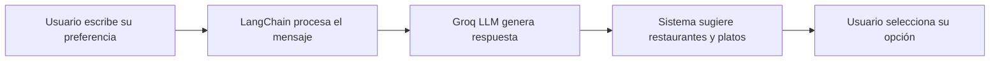

# Asistente de Inteligencia Artificial

GastroWeb incorpora un asistente de inteligencia artificial desarrollado con **Groq** y **LangChain** que interpreta tus preferencias gastronómicas en lenguaje natural y te sugiere restaurantes y platos acordes a tu solicitud.

## ¿Cómo funciona?

## ¿Cómo usarlo?

<Steps>
  <Step title="Abre el asistente">
    En la página de inicio haz clic en el ícono del asistente o en el campo **¿Qué quieres comer hoy?**
  </Step>
  <Step title="Escribe tu preferencia">
    Ingresa lo que deseas en lenguaje natural. Por ejemplo:
    - *"Quiero algo picante y económico"*
    - *"Tengo antojo de pizza"*
    - *"Recomiéndame algo para dos personas"*
    - *"Quiero comida saludable"*
  </Step>
  <Step title="Revisa las sugerencias">
    El asistente mostrará restaurantes y platos recomendados según tu solicitud.
  </Step>
  <Step title="Selecciona tu opción">
    Haz clic en el restaurante o plato de tu preferencia para ver más detalles.
  </Step>
</Steps>

## Tecnología del asistente

| Componente | Tecnología | Función |
|---|---|---|
| Proveedor LLM | Groq 0.37.1 | Modelo de lenguaje que procesa las solicitudes |
| Orquestación | LangChain Core 1.2.20 | Gestiona las cadenas de procesamiento |
| Integración | LangChain Groq 1.1.2 | Conecta LangChain con Groq |
| Monitoreo | LangSmith 0.7.22 | Trazabilidad y monitoreo de respuestas |

## Tips para mejores resultados

<Tip>
  Sé específico en tus solicitudes para obtener mejores sugerencias:
  - ✅ "Quiero comida italiana económica para llevar"
  - ✅ "Algo rápido y vegetariano cerca de mi zona"
  - ❌ "Quiero comer algo"
</Tip>

## Ejemplos de solicitudes

| Solicitud | Resultado esperado |
|---|---|
| "Quiero algo rápido y económico" | Restaurantes de comida rápida con precios bajos |
| "Tengo antojo de pizza" | Restaurantes con pizzas en el menú |
| "Comida para dos personas romántica" | Restaurantes con opciones para compartir |
| "Algo saludable sin gluten" | Restaurantes con opciones saludables |
| "Lo más pedido hoy" | Platos y restaurantes más populares del día |
